# Coffeelicious
## Full Stack Frameworks with Django Milestone Project by Susana Viruglio

Welcome to Coffeelicious, where we know that life is too short for a bad coffee and
dive into tastiest coffees from around the world. This Coffeeshop has been built by using a full stack framework with Django, your journey starts here.

[Visit Coffeelicious!](https://coffeelicious-0a5548d626d6.herokuapp.com/)

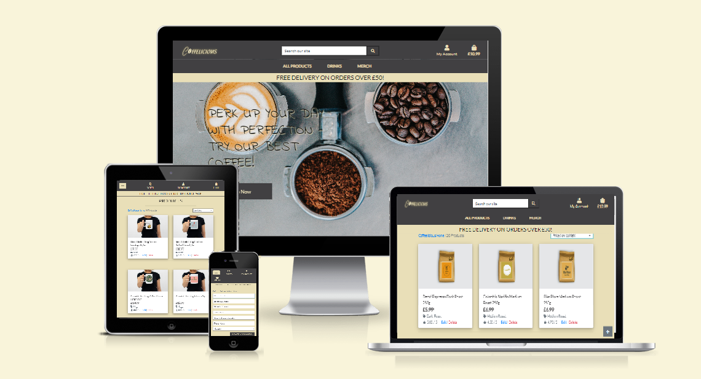

### External User Goals

- Easily find coffee or similar drink through the coffee shop's products.

- Provide categories and filter products to help users find specific type of coffee, tea, etc.

- Detail information about each item.

- Users may wish to create an account to improve their experience by allowing registration.

- Provide a shopping cart visible and easy to access; easy to delete, to add or modify.

### Site Owner's Goals

- To maximize profitability by creating a web which makes the website more attractive for customers.

### Potential Features To Include

- User registration and profile.

- A coffee catalogue and a range of merchandise with images and well organized.

- Product search and filter to help users to find easily specific products.

- Shopping cart.

- Promotions and discounts.

## UX AIMS

- As a shopper I would like to be able to view a list of coffee products, so I can select some to purchase.

- Clicking on an individual product, so I am able to view product details and identify the price, product description, product rating, product image.

- A navigation menu that allows users to identify deals or special offers.

- Create an user account which allows to make purchases.

### QUESTIONS FROM USERS

1. **How can create an user account?** I would like to create an account and log in so I am able to save all my bank details the next time I wish to do another purchase.

2. **I would like to buy coffee but I do not want to create an account** It is possible to make purchases as a guest in this store.

3. **Where can I found special offers?** In the navigation menu allows users to be able to see easily offers or special deals.

4. **Where am I able to see how much I spend in total?** A real shopping indicator that allows users to view total amount of the purchase at any time ir order to avoid spending too much.

5. **I have forgotten my password** Reset the users'password if the have forgotten.

## DESIGN EVOLUTION

### First Idea

At the beginning, I wanted to create a card for each product, so the user would be able to see all the items, but I changed it as a simple image with few details in case if the customer was interested in a specific product would be able to click to search for more details.

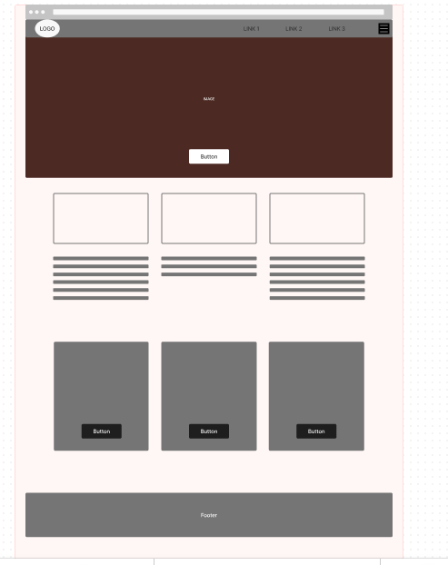

### Products Design

While creating the database, I considered that it might be challenging to locate identical images for various types of coffees. So I used the same images, created the logos by myself and replaced on the top of each one. If you are interested in knowing where I found the logos, you will find them in *Credits* at the bottom.

**Logo Design**

**Home Page Background Image Design**

**Coffee Beans Design**

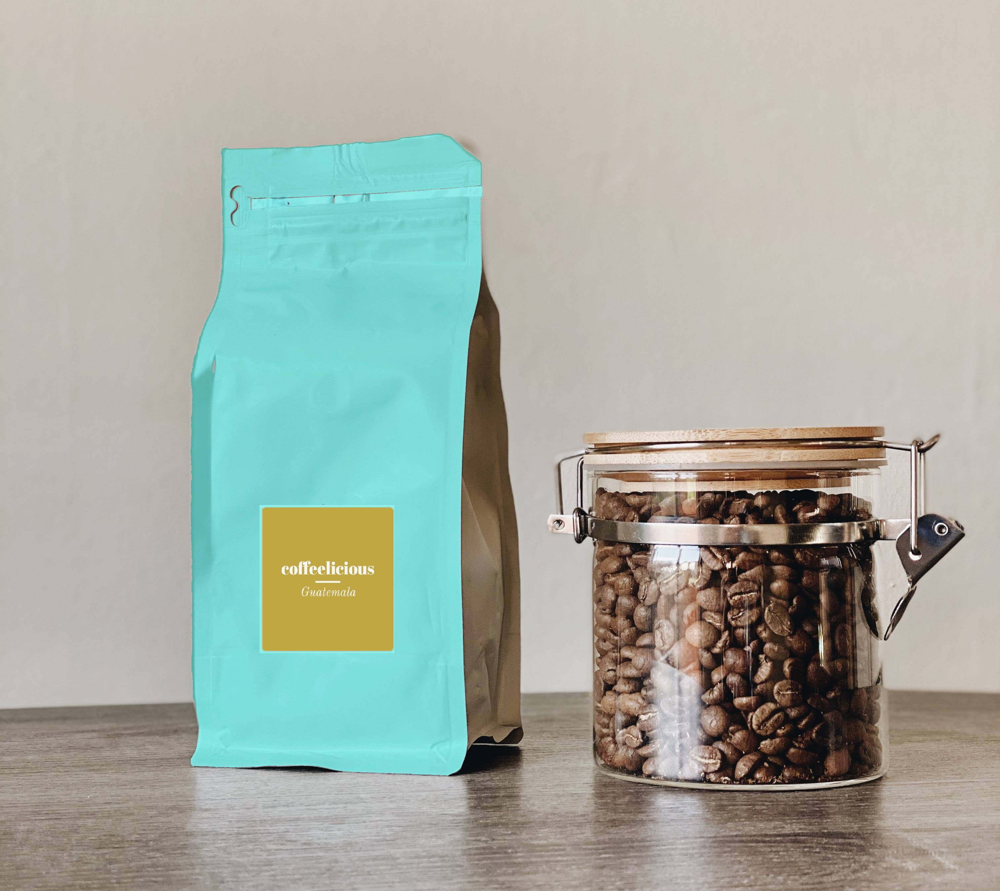

**Dark Coffee Design**

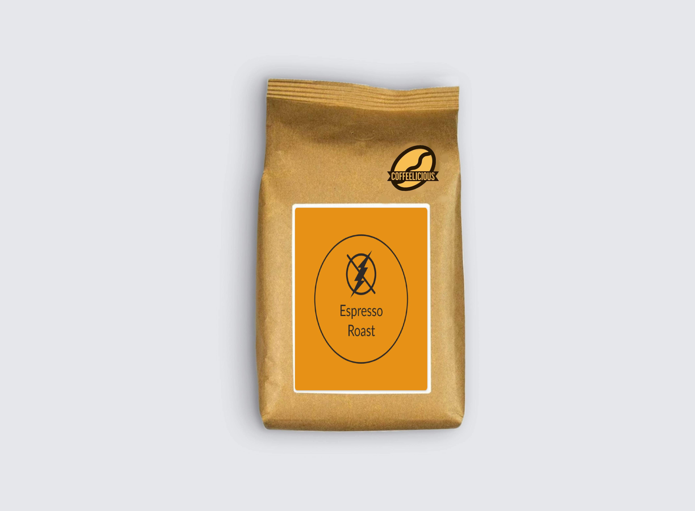

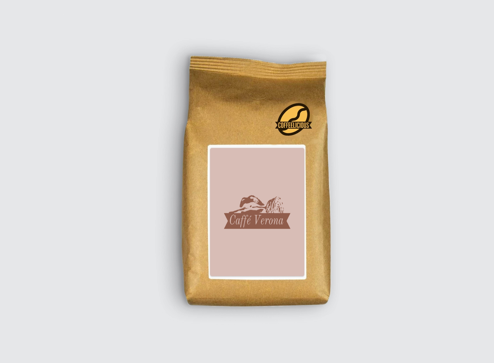

**Medium Coffee Design**

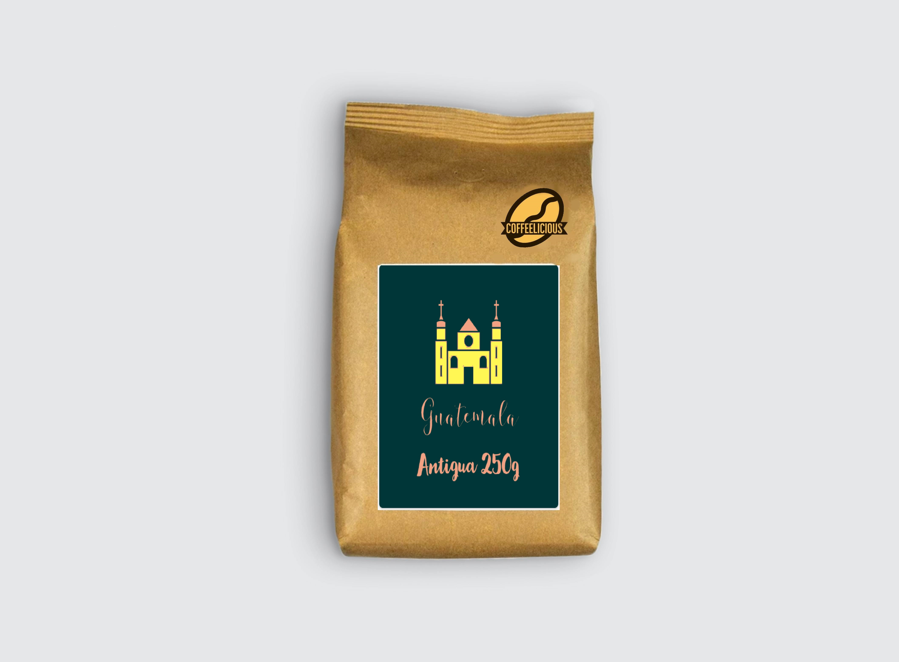

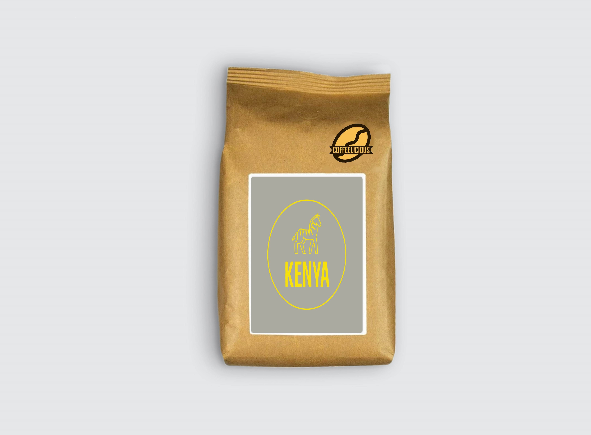

**Coffee Mugs Design**

**Coffee T-shirts Design**

**No Image**

### DATABASE EVOLUTION

**ERDplus Diagram for a database**

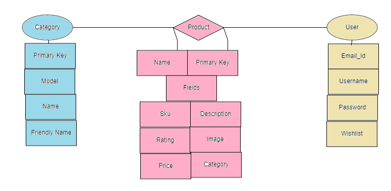

**Database Tables**

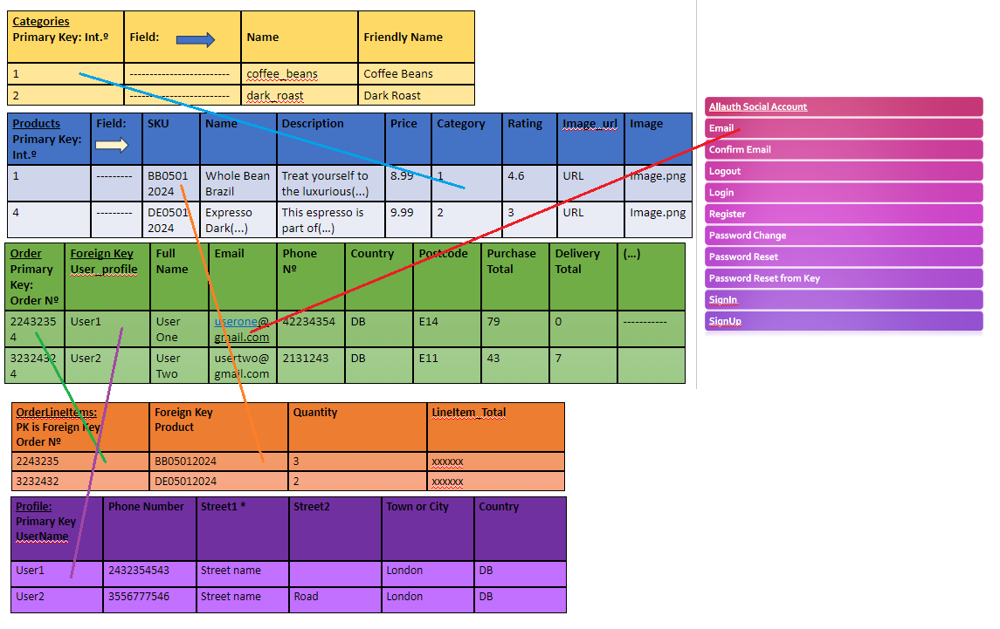

## TESTING 

**Path Error while Deploying**

When I deployed to Heroku, I was unable to view the drinks Category on the web. I fixed it by checking the path on main-nav.html. At the project's outset, after creating the database, I manually changed the ID names of the categories in Django. Consequently, during migration to the ElephantSQL database, it retained information from my categories.json instead of Django. I addressed the issue by correcting the typo, and the modification proved successful.

**Allauth Directory Templates**

I created a directory templates allauth because I wanted to customize the allauth templates in my own allauth, so this ensures that my templates take precedence over the built ones.
This gives a copy of every single Allauth template.
I tried to copy everything that I needed with the command cp -r which means to copy recursively
../ to go up one level from where we are right now.
	cp -r ../.pip-modules/lib/python3.9.17/site-packages/allauth/templates/* ./templates/allauth
so this link did not work so I typed : find / -type d -name "allauth" and I found the real directory for gitpod
	cp -r /workspace/.pip-modules/lib/python3.9/site-packages/allauth/templates/* ./templates/allauth/
**Bad Request** 

When I was working on my Profile app, I encountered with Bad Request error:

"Bad Request: /checkout/wh/ [13/Jan/2024 11:29:33] "POST /checkout/wh/ HTTP/1.1" 400 0".

I found out that normally it indicates that the server did not understand the request. I realised that I forgot to import settings.py on my webhook_handler.py file.

**Template Does Not Exist**

I received this error message when I was trying to access checkout.html file:
"TemplateDoesNotExist at /checkout/includes/toasts/warning.html"

It was another typo in my spellings because I forgot an in s in warnings.html

**Module Not Found**

When I was trying to run the server I encountered wit this error in the terminal:

"ModuleNotFoundError: No module named 'checkoutcrispy_forms'"

I was checking everywhere for the error, but it was a typo in my settings.py I forgot to add a comma in my intalled_apps.

**Type Error**

I encountered 'TypeError' at line 48 of the adjust_shopping_bag function in the views.py file. To resolve the issue I had to review carefully the views.py specifically in the line 48.

I looked for the line where I was using square brackets to access an item, like bag.pop[item_id] instead of using parentheses "bag.pop(item_id)".

## DEPLOYMENT

### Github

This project does not followed Github deployment process, but it is link to Heroku.

[Web link once deployed](https://coffeelicious-0a5548d626d6.herokuapp.com/)

### HEROKU and ELEPHANTSQL

Deploying a Python application on Heroku involves several steps. Here's a general guide:
If you don't have a Heroku account, sign up for one at Heroku's website.
1. Create an account with ElephantSQL
2. Authorise ElephantSQL with your selected GitHub account
3. In the Create new team form:
   - Add a team name (your own name is fine)
   - Read and agree to the Terms of Service
   - Select Yes for GDPR
   - Provide your email address
   - Click “Create Team”
4. Your account is successfully created!
Create a database
5. Click “Create New Instance”
6. Set up your plan (give a name, select the tiny turtle plan and Irish region)
7. Select data center near you (Ireland)
8. Then, click Review
9. Check your details are correct and then click “Create instance”
10. Return to the ElephantSQL dashboard and click on the database instance name for this project
11. In the URL section, clicking the copy icon will copy the database URL to your clipboard
12. Leave this tab open, we will come back here later

Before we can build our application on Heroku, we need to create a few files that Heroku will need to run our application:

- A requirements.txt file which contains a list of the Python dependencies that our project needs in order to run successfully.

- A Procfile which contains the start command to run the project.

**Process**

1. Generate the requirements.txt file with the following command in the terminal. After you run this command a new file called requirements.txt should appear in your root directory

 *pip freeze --local > requirements.txt*

2. Heroku requires a Procfile containing a command to run your program. Inside the root directory of your project create the new file. It must be called Procfile with a capital P, otherwise Heroku won’t recognise it

3. Inside the file, add the following command:

*web: gunicorn projectname.wsgi:application*

4. In the terminal, install dj_database_url and psycopg2, both of these are needed to connect to your external database.

*pip3 install dj_database_url==0.5.0 psycopg2*

5. Update your requirements.txt file with the newly installed packages

*pip freeze --local > requirements.txt*

6. In your settings.py file, import dj_database_url underneath the import for os

*import os*

*import dj_database_url*

7. Scroll to the DATABASES section and update it to the following code, so that the original connection to sqlite3 is commented out and we connect to the new ElephantSQL database instead. Paste in your ElephantSQL database URL in the position indicated
 
*DATABASES = {*

*'default': dj_database_url.parse('your-database-url-here')*

*}*

**DO NOT commit this file with your database string in the code, this is temporary so that we can connect to the new database and make migrations. We will remove it in a moment.**

8. In the terminal, run the showmigrations command to confirm you are connected to the external database

 *python3 manage.py showmigrations*

9. Migrate your database models to your new database

*python3 manage.py migrate*

10. Load in the fixtures. Please note the order is very important here. We need to load categories first

*python3 manage.py loaddata categories*

11. Then products, as the products require a category to be set

 *python3 manage.py loaddata products*

12. Create a superuser for your new database

*python3 manage.py createsuperuser*

13. Finally, to prevent exposing our database when we push to GitHub, we will delete it again from our settings.py - we’ll set it up again using an environment variable in the next video - and reconnect to our local sqlite database. For now, your DATABASE setting in the settings.py file should look like this

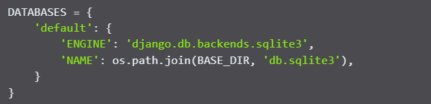

14. Confirm the database, click to *Browser* and select auth_user, but you may want to check your other databases as well. Now ready to deploy to Heroku.

**Heroku process**

Now that you have your database and code in your IDE configured, we will add it to a Heroku app using a new environment variable (Config Var) called DATABASE_URL. Then our Heroku app will be able to connect to the external database.

1. Log into Heroku.com and click “New” and then “Create a new app”
2. Choose a unique name for your app, select the region closest to you and click “Create app”
3. Go to the Settings tab of your new app
4. Click Reveal Config Vars
5. Return to your ElephantSQL tab and copy your database URL
6. Back on Heroku, add a Config Var called DATABASE_URL and paste your ElephantSQL database URL in as the value. Make sure you click “Add”
7. Add each of your other environment variables except DEVELOPMENT and DB_URL from the env.py file as a Config Var. The result should look something like this:

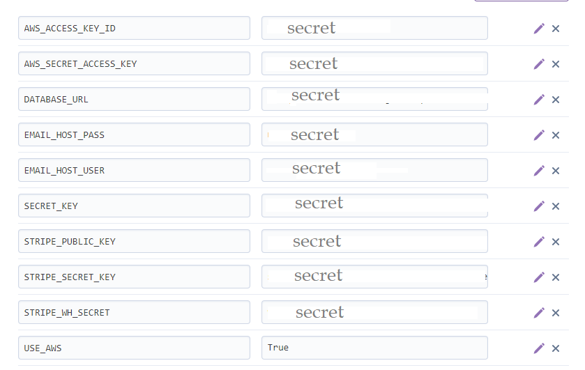

**Deploy the app**

1. To prepare to deploy to Heroku first we need to install gunicorn.

*pip3 install gunicorn*

2. Then save it in requirements.txt

*pip3 freeze > requirements.txt*

3. Login in Heroku in the terminal

*heroku login*

4. Config Heroku to connect to the Heroku app.

*heroku config:set DISABLE_COLLECTSTATIC=1 --plan coffeelicious (it is the name of the heroku app in this case is coffeeliciuos)*

5. Now in your settings.py we need to allow host with your app name:

*ALLOWED_HOSTS = ['your-heroku-app-name.herokuapp.com', 'localhost']*

6. Change your secret key in settings.py because it is very important to keep it save.

*SECRET_KEY = os.environ.get('SECRET_KEY', '')*

7. One of the things that Heroku has issues is with Debug equal to False, if you set it to False you will not able to see your web. Even though, you never should have Debug equal to True when you deploy your website because you would be exposing all your secret keys. In this case we must do this:

*DEBUG = 'DEVELOPMENT' in os.environ*

### AWS AMAZON

Amazon Web Services (AWS) is a cloud computing platform that provides a wide range of services to help businesses and developers build and deploy applications more effectively. For Django, AWS offers various services that can be leveraged to host, deploy, and scale Django applications. 

1. First, create an account.

2. Crate a bucket; when creating a bucket it can left default, but the Object Ownership setting (below) needs to be set as shown with the ACLs enabled option checked.

3. Buckets settings.The S3 Bucket options page is now a scrollable page broken into sections.
4. On the properties tab static website hosting can now be found, by scrolling down to the
bottom. AWS has changed the format of their CORS configuration - the updated code is shown below. Paste that into the Cross-origin resource sharing (CORS) section.

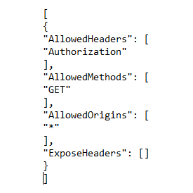

5. Bucket policy.
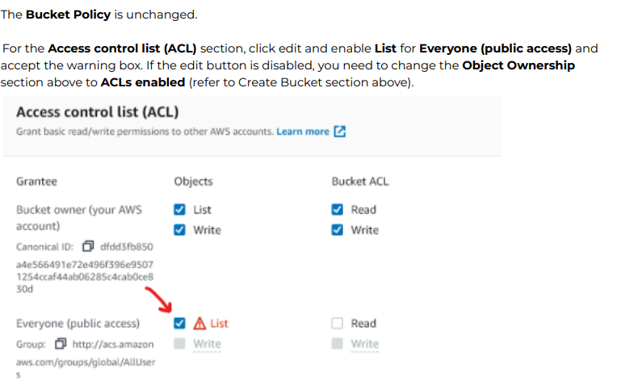

6. Identify and Management (IAM), create a group with the name of your choice and create a policy.

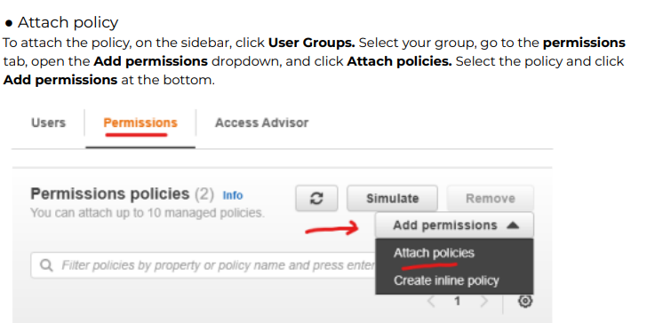

7. Retrieve access Key
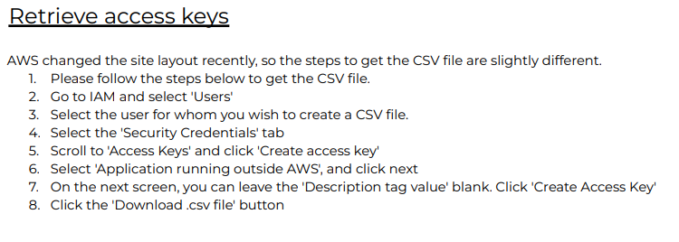

8. Once you have add it to Heroku, then you will need to create a folder in AWS Amazon name *media* and add all your pictures from your PC. If you do not have access to your images any more I suggest to download from your *github*.

## HTML AND CSS VALIDATOR
### HTML

### CSS

### JAVASCRIPT

### PYTHON

### LIGHTHOUSE

## CREDITS
All the code that I have used to create this website was taken from Code Institute learning platform and from the next following sources:

[BOOTSTRAP](https://getbootstrap.com/docs/5.1/getting-started/introduction/)
HTML 

[UNPLUSH](https://unsplash.com/photos/brown-and-blue-plastic-pack-mSjTAV7JuV4)
Coffee images were taken from this free Unplush but I modified the logo for each type of coffee.

[LOGO MAKER](https://www.adobe.com/express/create/logo)
Logo design for each coffee were taken from this free source and I pasted on the coffee bag.

[STARBUCKS](https://www.starbucks.co.uk/menu/at-home/whole-bean)
Coffee information and product structure and category names.

[TEXTFIXER](https://www.textfixer.com/tools/paragraph-to-lines.php)
Paragraph converter for the json file.

[W3SCHOOL](https://www.w3schools.com/css/css3_shadows_box.asp)
Box shadow effect for the product images

## EXTRA INFORMATION 

